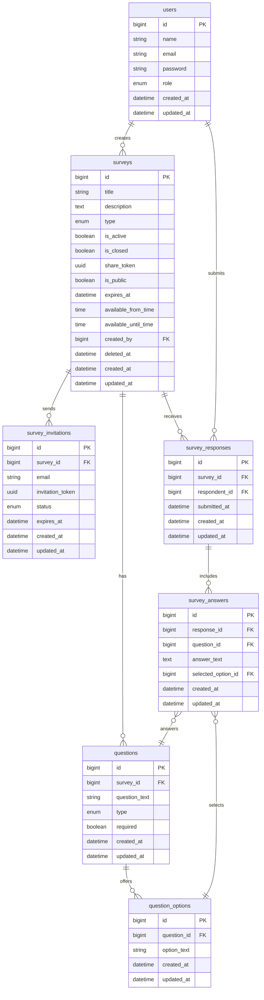

# Survey API Documentation

## Overview

Survey API is a Laravel 12 backend that powers an Android client. It provides token-based authentication (Laravel Sanctum), role-based access (admin, creator, respondent), survey lifecycle management (creation, sharing, invitations, submissions), and soft-deletable surveys with manual closing.

## Roles & Capabilities

| Role       | Capabilities                                                                                     |
| ---------- | ------------------------------------------------------------------------------------------------ |
| Admin      | Full access, including viewing/restoring deleted surveys                                         |
| Creator    | Create/manage surveys, questions, invitations, sharing, closing/reopening, deleting              |
| Respondent | View eligible surveys, submit responses (must be authenticated)                                  |

## Route Placeholders & Tokens

| Placeholder/Token    | What it represents                                                                 | Example usage                             |
| -------------------- | ---------------------------------------------------------------------------------- | ----------------------------------------- |
| `{survey}`           | Numeric ID of the survey resource; scoped to creator/admin ownership rules         | `/api/surveys/{survey}`                   |
| `{question}`         | Numeric ID of a survey question belonging to `{survey}`                            | `/api/surveys/{survey}/questions/{question}` |
| `{share_token}`      | UUID generated for public sharing; identifies a read-only public survey link       | `/api/public/surveys/{share_token}`       |
| `{invitation_token}` | UUID stored with `survey_invitations`; used to validate invite status and ownership | `/api/public/invite/{invitation_token}`   |

All IDs/tokens uniquely identify the referenced resource. Controllers resolve them via implicit route-model binding (IDs) or custom lookup logic (tokens) before delegating to services, ensuring authorization and validation are consistently enforced.

## Environment & Configuration

All runtime values are environment driven:

- `.env` → `config/*.php` → usage in controllers/services/mail.
- `APP_URL` defines the base URL used across the app (e.g., invite links).
- `FRONTEND_INVITE_PATH` controls the invite path appended to `APP_URL` (config/frontend.php).
- Mail settings use standard Laravel mail config.

Example `.env` snippet:

```
APP_URL=https://api.example.com
FRONTEND_INVITE_PATH=invite
SANCTUM_STATEFUL_DOMAINS=localhost
MAIL_MAILER=smtp
MAIL_HOST=mailhog
MAIL_PORT=1025
```

## Authentication

All protected routes use Sanctum tokens:

| Method | Endpoint      | Description                        |
| ------ | ------------- | ---------------------------------- |
| POST   | `/api/register` | Register a new user               |
| POST   | `/api/login`    | Login, receive Sanctum token     |
| POST   | `/api/logout`   | Logout (auth required)           |
| GET    | `/api/me`       | Current user profile             |

### Android Kotlin Auth Example

Use Retrofit (or another HTTP client) to call `/api/login`, then persist the returned token and attach it as a Bearer header for every protected request. The base URL should come from Android build config (e.g., `BuildConfig.API_BASE_URL`) so it mirrors the backend `APP_URL`.

```kotlin
data class LoginRequest(val email: String, val password: String)
data class LoginResponse(val success: Boolean, val message: String, val data: LoginPayload)
data class LoginPayload(val user: UserDto, val token: String)

interface AuthApi {
    @POST(\"/api/login\")
    suspend fun login(@Body payload: LoginRequest): LoginResponse

    @GET(\"/api/me\")
    suspend fun me(@Header(\"Authorization\") bearer: String): UserResponse
}

class AuthRepository(private val api: AuthApi, private val tokenStore: TokenStore) {
    suspend fun login(email: String, password: String) {
        val response = api.login(LoginRequest(email, password))
        if (!response.success) error(response.message)
        tokenStore.save(response.data.token)
    }

    suspend fun currentUser(): UserDto {
        val token = tokenStore.read() ?: error(\"Missing token\")
        return api.me(\"Bearer $token\").data.user
    }
}

fun buildHttpClient(tokenStore: TokenStore) = OkHttpClient.Builder()
    .addInterceptor { chain ->
        val builder = chain.request().newBuilder()
        tokenStore.read()?.let { builder.header(\"Authorization\", \"Bearer $it\") }
        chain.proceed(builder.build())
    }
    .build()
```

`TokenStore` can wrap EncryptedSharedPreferences, DataStore, or another secure persistence layer. Logout simply deletes the stored token and invokes `/api/logout` to revoke the active Sanctum token.

## Surveys – Creator/Admin

| Method | Endpoint                               | Description                                       |
| ------ | -------------------------------------- | ------------------------------------------------- |
| POST   | `/api/surveys`                         | Create survey (title, type, description, window)  |
| POST   | `/api/surveys/{survey}/share`          | Toggle public share + optional expiration         |
| POST   | `/api/surveys/{survey}/invite`         | Send email invitations (multi-email)              |
| POST   | `/api/surveys/{survey}/questions`      | Add question (text/single/multiple choice)        |
| PATCH  | `/api/surveys/{survey}/close`          | Manually close survey                             |
| PATCH  | `/api/surveys/{survey}/reopen`         | Reopen closed survey                              |
| DELETE | `/api/surveys/{survey}`                | Soft delete survey                                |

## Surveys – Respondent Listing

| Method | Endpoint        | Query Params                         | Notes                                                                                                                     |
| ------ | --------------- | ------------------------------------ | ------------------------------------------------------------------------------------------------------------------------- |
| GET    | `/api/surveys` | `type`, `status`, `search`, pagination | Behavior depends on role. Respondents only see active, unexpired, time-window eligible surveys they haven’t submitted, and that are public or have pending invitations. Creators see their surveys; admins see all. |

Response format:

```json
{
  "success": true,
  "message": "Surveys retrieved successfully",
  "data": [
    {
      "id": 1,
      "title": "Lunch Feedback Poll",
      "type": "poll",
      "is_active": true,
      "is_closed": false,
      "available_now": true,
      "already_submitted": false
    }
  ],
  "meta": {
    "current_page": 1,
    "per_page": 15,
    "total": 20,
    "last_page": 2
  }
}
```

## Submissions – Respondent

| Method | Endpoint                             | Description                                                                                             |
| ------ | ------------------------------------ | ------------------------------------------------------------------------------------------------------- |
| POST   | `/api/surveys/{survey}/submit`       | Submit answers. Requires respondent role + authentication. Accepts optional `invitation_token`. Ensures survey is active, open, not soft-deleted, unexpired, and within time window. |

Example payload:

```json
{
  "invitation_token": "optional",
  "answers": [
    {"question_id": 45, "answer_text": "Great variety"},
    {"question_id": 46, "selected_option_id": 301},
    {"question_id": 47, "selected_option_ids": [412, 413]}
  ]
}
```

Validation rules:

- Text questions require `answer_text` and forbid option selections.
- Single choice requires `selected_option_id` (exactly 1).
- Multiple choice requires `selected_option_ids` (>=1).
- Required questions must have answers.
- Chosen options must belong to the question.

## Invitations & Public Access

| Method | Endpoint                                  | Description                                         |
| ------ | ----------------------------------------- | --------------------------------------------------- |
| GET    | `/api/public/surveys/{share_token}`       | Public survey metadata (no submission)              |
| GET    | `/api/public/invite/{invitation_token}`   | Invitation landing data (email + survey info)       |

Submitting still requires authentication (see above).

## Admin Soft-Delete Management

| Method | Endpoint                             | Description                   |
| ------ | ------------------------------------ | ----------------------------- |
| GET    | `/api/admin/surveys/deleted`         | Paginated soft-deleted list   |
| PATCH  | `/api/admin/surveys/{survey}/restore`| Restore soft-deleted survey   |

Deleted surveys never appear in standard listings or submissions until restored.

## Manual Close Logic

- `is_closed` flag prevents new submissions (respondents receive 403 with `"Survey is closed"`).
- Closing doesn’t delete data; creators/admins can reopen.

## Soft Delete Behavior

- `DELETE /api/surveys/{id}` uses soft deletes.
- Questions/responses remain intact.
- Use admin endpoints to review/restore.

## Resources & Services

- `SurveyService`: core business logic (creation, listing, deletion, close/reopen, restore, filtering).
- `SurveySubmissionController`: ensures availability, duplicate prevention, invitation validation.
- `ResponseService`: validates & stores answers per question type, marks invitations completed.
- `ShareService`, `InvitationService`, `QuestionService`: manage respective domains.
- `SurveyListResource`, `SurveyResource`, `QuestionResource`, etc., provide consistent API shapes.

## Mail / Invitations

- `SurveyInvitationMail` uses `config('app.url')` + `config('frontend.invite_path')` to build invite links (no hardcoded domains).
- SMTP credentials are defined only in `.env` and `config/mail.php`.

## Testing

- Run `php artisan test` for the bundled Feature & Unit tests.
- Postman collection is available on request (`docs/PROJECT_DOCUMENTATION.md` references endpoints for manual testing).

## Deployment Notes

- Run `php artisan migrate` to apply all schema changes (users, surveys, questions, responses, etc.).
- Ensure cron/queue workers are configured if invitations will be queued (optional).
- Set `APP_URL`, `FRONTEND_INVITE_PATH`, mail config, and DB credentials per environment.

## Database Diagram



### Database Tables

#### users
| Field | Type | Notes |
| --- | --- | --- |
| id | bigint PK | |
| name | string | |
| email | string | unique |
| password | string | hashed |
| role | enum | admin / creator / respondent |
| created_at | datetime | |
| updated_at | datetime | |

#### surveys
| Field | Type | Notes |
| --- | --- | --- |
| id | bigint PK | |
| title | string | |
| description | text | nullable |
| type | enum | poll / survey |
| is_active | boolean | default true |
| is_closed | boolean | manual close flag |
| share_token | uuid | nullable |
| is_public | boolean | default false |
| expires_at | datetime | nullable |
| available_from_time | time | nullable |
| available_until_time | time | nullable |
| created_by | bigint FK | references users.id |
| deleted_at | datetime | soft delete |
| created_at | datetime | |
| updated_at | datetime | |

#### questions
| Field | Type | Notes |
| --- | --- | --- |
| id | bigint PK | |
| survey_id | bigint FK | references surveys.id |
| question_text | string | |
| type | enum | text / single_choice / multiple_choice |
| required | boolean | |
| created_at | datetime | |
| updated_at | datetime | |

#### question_options
| Field | Type | Notes |
| --- | --- | --- |
| id | bigint PK | |
| question_id | bigint FK | references questions.id |
| option_text | string | |
| created_at | datetime | |
| updated_at | datetime | |

#### survey_invitations
| Field | Type | Notes |
| --- | --- | --- |
| id | bigint PK | |
| survey_id | bigint FK | references surveys.id |
| email | string | invitee email |
| invitation_token | uuid | unique |
| status | enum | pending / completed |
| expires_at | datetime | nullable |
| created_at | datetime | |
| updated_at | datetime | |

#### survey_responses
| Field | Type | Notes |
| --- | --- | --- |
| id | bigint PK | |
| survey_id | bigint FK | references surveys.id |
| respondent_id | bigint FK | references users.id |
| submitted_at | datetime | |
| created_at | datetime | |
| updated_at | datetime | |

#### survey_answers
| Field | Type | Notes |
| --- | --- | --- |
| id | bigint PK | |
| response_id | bigint FK | references survey_responses.id |
| question_id | bigint FK | references questions.id |
| answer_text | text | nullable (text questions) |
| selected_option_id | bigint FK | nullable, references question_options.id |
| created_at | datetime | |
| updated_at | datetime | |
